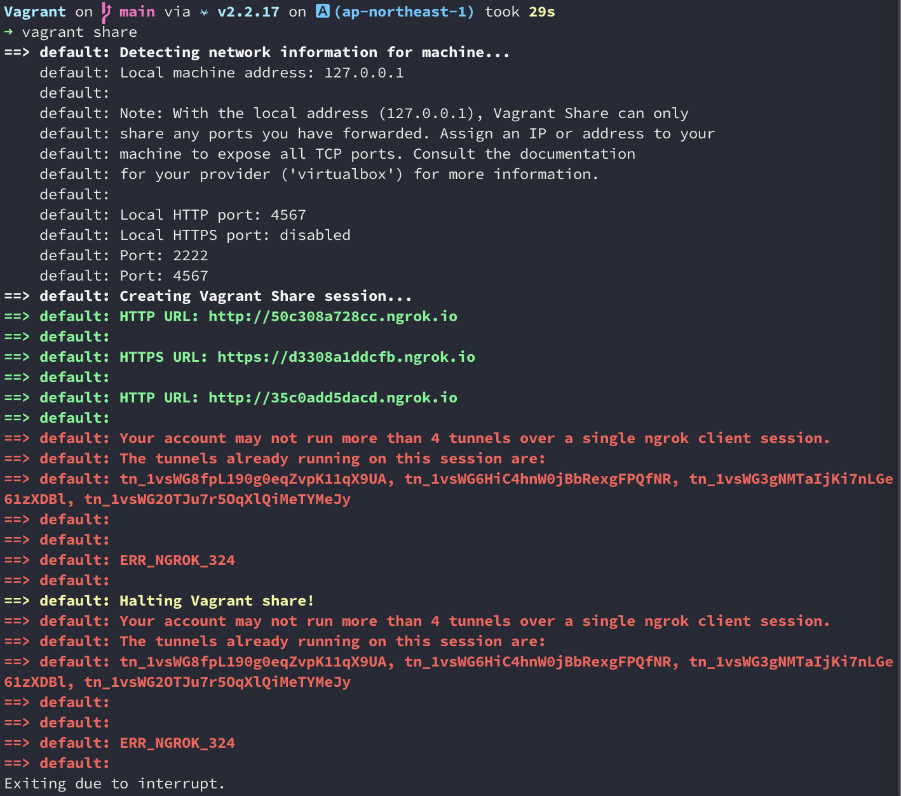

Vagrant Getting Started
=======================

`Tutorial Url <https://learn.hashicorp.com/collections/vagrant/getting-started>`_

hashicorp/bionic64 Box is Ubuntu 18.0.4

#. create Vagrantfile

::

  $ vagrant init hashicorp/bionic64
  $ vagrant up

or 

::

  $ vagrant box add hashicorp/bionic64

Find More Boxes
***************

`HashiCorp Vagrant Cloud box catalog <https://vagrantcloud.com/boxes/search>`_

destroy and remove
===============
::

  Vagrant on  main via ⍱ v2.2.17 on 🅰 (ap-northeast-1) took 2s
  ➜ vagrant status
  Current machine states:

  default                   running (virtualbox)

  The VM is running. To stop this VM, you can run `vagrant halt` to
  shut it down forcefully, or you can run `vagrant suspend` to simply
  suspend the virtual machine. In either case, to restart it again,
  simply run `vagrant up`.
  
  Vagrant on  main via ⍱ v2.2.17 on 🅰 (ap-northeast-1) took 2s
  ➜ vagrant destroy
    default: Are you sure you want to destroy the 'default' VM? [y/N] y
  ==> default: Forcing shutdown of VM...
  ==> default: Destroying VM and associated drives...

  Vagrant on  main via ⍱ v2.2.17 on 🅰 (ap-northeast-1) took 7s
  ➜ vagrant status
  Current machine states:

  default                   not created (virtualbox)

  The environment has not yet been created. Run `vagrant up` to
  create the environment. If a machine is not created, only the
  default provider will be shown. So if a provider is not listed,
  then the machine is not created for that environment.

  Vagrant on  main via ⍱ v2.2.17 on 🅰 (ap-northeast-1)
  ➜ vagrant box list
  hashicorp/bionic64 (virtualbox, 1.0.282)

  Vagrant on  main via ⍱ v2.2.17 on 🅰 (ap-northeast-1)
  ➜ vagrant box remove hashicorp/bionic64
  Removing box 'hashicorp/bionic64' (v1.0.282) with provider 'virtualbox'...

Share an Enviromment
==============

* vagrant plugin install vagrant-share
* run vagrant share

`ngrok <https://dashboard.ngrok.com>`_

Teardown an Environment
=====================

* vagrant suspend
* vagrant halt
* vagrant destroy

Rebuild an Enviromment
=====================

* vagrant up

Explore Other Providers
====================

* vagrant up --provider=vmware_desktop

